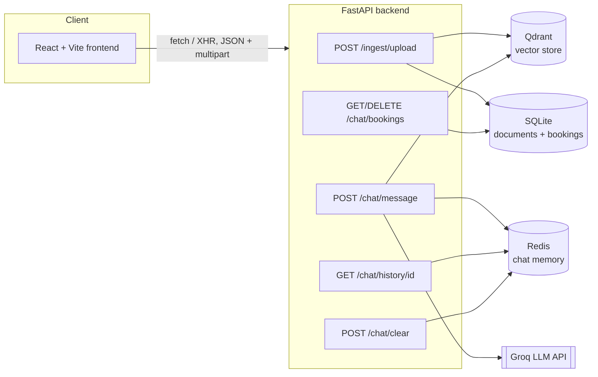

# Grounded Rag Assistant with Two REST APIs

[](LICENSE)

A full-stack Retrieval-Augmented Generation (RAG) system: a FastAPI backend exposing two REST APIs (document ingestion and conversational RAG with LLM-powered interview booking), and a React frontend that drives every endpoint.

Personal portfolio project, built for learning and demonstration. Feedback and forks welcome.

---

## Architecture



The frontend never talks to Qdrant, Redis, or Groq directly — everything is mediated by the FastAPI layer. This keeps API keys and infra credentials server-side only.

---

## Tech Stack

| Layer              | Tool                               |
| ------------------ | ----------------------------------- |
| Frontend framework | React 18 + Vite                     |
| Frontend styling   | Plain CSS (no UI framework), Source Serif 4 / Inter / IBM Plex Mono via Google Fonts |
| HTTP client        | Native `fetch` + `XMLHttpRequest`* |
| Web framework      | FastAPI + Uvicorn                   |
| Vector database    | Qdrant (Docker)                     |
| Chat memory        | Redis (Docker)                      |
| Metadata DB        | SQLite via SQLAlchemy               |
| Embeddings         | sentence-transformers (local CPU)   |
| LLM                | Groq API (llama-3.1-8b-instant)     |
| PDF parsing        | PyMuPDF                             |
| Sentence chunking  | NLTK                                |

*`XMLHttpRequest` is used only for the upload endpoint, because `fetch` has no upload-progress event — that's the only way to drive a real progress bar.

---

## Prerequisites

- Python 3.11+
- Node.js 18+ and npm
- Docker Desktop (for Qdrant + Redis)
- A free Groq API key from [console.groq.com](https://console.groq.com)

---

## Required Backend Change: Enable CORS

The frontend runs on a different origin (`localhost:5173` in dev, `localhost:3000` behind nginx) than the backend (`localhost:8000`). Without CORS headers, the browser blocks every request with a CORS error even though the API works fine in `curl` or `/docs`. Add this to `backend/app/main.py` before running the frontend:

```python
from fastapi.middleware.cors import CORSMiddleware  # add to the import block

# ... after app = FastAPI(...)

app.add_middleware(
    CORSMiddleware,
    allow_origins=["http://localhost:5173", "http://localhost:3000"],
    allow_credentials=True,
    allow_methods=["*"],
    allow_headers=["*"],
)
```

Restart `uvicorn` after adding this — CORS middleware doesn't apply on `--reload` alone.

---

## Setup

### 1. Clone the repository

```powershell
git clone https://github.com/Anup806/Backend-RAG-with-Two-RESTAPI
cd Backend-RAG-with-Two-RESTAPI
```

### 2. Backend — environment and dependencies

```powershell
python -m venv .venv
.venv\Scripts\activate
pip install -r backend\requirements.txt
copy .env.example .env
```

Open `.env` and set your Groq key:

```
GROQ_API_KEY=your_actual_groq_api_key_here
```

### 3. Start Qdrant and Redis

```powershell
docker compose up -d qdrant redis
docker ps
```

You should see `backend_qdrant` and `backend_redis` both `Up`.

### 4. Run the backend

```powershell
cd backend
uvicorn app.main:app --reload
```

- API: `http://localhost:8000`
- Interactive docs: `http://localhost:8000/docs`

### 5. Frontend — environment and dependencies

In a new terminal, from the project root:

```powershell
cd frontend
copy .env.example .env
npm install
npm run dev
```

- App: `http://localhost:5173`

---

## API Reference

### Health Check

#### `GET /`
Returns service status and a list of the two main API prefixes. Polled by the frontend's connection status indicator.

### Document Ingestion API

#### `POST /ingest/upload`

Upload a PDF or TXT file and ingest it into the RAG system.

| Field    | Type   | Required | Description           |
| -------- | ------ | -------- | ---------------------- |
| file     | File   | Yes      | PDF or TXT file        |
| strategy | String | Yes      | `fixed` or `sentence`  |

```powershell
curl -X POST "http://localhost:8000/ingest/upload" `
  -F "file=@C:\path\to\document.pdf" `
  -F "strategy=sentence"
```

Response:

```json
{
  "message": "Document ingested successfully.",
  "document_id": 1,
  "filename": "document.pdf",
  "strategy_used": "sentence",
  "total_chunks_stored": 42
}
```

### Conversational RAG API

#### `POST /chat/message`

```json
{ "session_id": "optional-existing-session-id", "message": "What is the refund policy?" }
```

If `session_id` is omitted, one is generated and returned. If the message contains complete interview-booking details (name, email, date, time), the LLM extracts them and books the interview instead of running retrieval.

```json
{
  "session_id": "abc-123-...",
  "response": "The refund policy states that...",
  "booking": null,
  "sources": [
    { "filename": "refund_policy.pdf", "snippet": "Refunds are issued within 14 days of purchase, provided…", "score": 0.812 },
    { "filename": "terms.docx", "snippet": "All monetary refunds are processed via the original payment method…", "score": 0.734 }
  ]
}
```

`sources` is always present, but it's only ever populated on a genuine retrieval answer:

- **Booking-flow turns** (collecting fields or confirming a booking) always return `sources: []` — a booking confirmation isn't grounded in a document, so it shouldn't claim to be.
- **The "I don't have information about that in the uploaded documents" fallback** also returns `sources: []`, even though chunks were retrieved. Citing chunks the model explicitly said it couldn't answer from would misrepresent "I don't know" as a grounded answer.
- Each entry is deduplicated to one per source file — the file's highest-scoring chunk — and sorted by score descending.
- Sources are **not** persisted to Redis history. `memory.py` only stores `role`/`content` per turn, so refreshing the page loses the citation chips on older messages even though the reply text remains.

#### `GET /chat/history/{session_id}`
Full conversation history for a session, from Redis.

#### `POST /chat/clear`
```json
{ "session_id": "abc-123-..." }
```

#### `GET /chat/bookings`
All interview bookings stored in SQLite.

#### `DELETE /chat/bookings/{session_id}`
Deletes **every** booking tied to that `session_id` — there is no per-booking delete endpoint. The frontend's Bookings tab groups rows by session for this reason, so the delete action matches what actually happens on the backend.

---

## Chunking Strategies

| Strategy   | How it works                                                | Best for                       |
| ---------- | ------------------------------------------------------------ | -------------------------------- |
| `fixed`    | 500-character chunks with 50-character overlap               | Long uniform text, reports       |
| `sentence` | Groups 5 sentences per chunk using NLTK sentence tokenizer    | Articles, conversational text    |

---

## Project Structure

```
project-root/
├── backend/
│   ├── app/
│   │   ├── main.py                  # FastAPI app, startup tasks, router registration
│   │   ├── api/
│   │   │   ├── ingestion.py         # POST /ingest/upload
│   │   │   └── conversation.py      # /chat/* endpoints
│   │   ├── services/
│   │   │   ├── extractor.py         # PDF/TXT text extraction (PyMuPDF)
│   │   │   ├── chunker.py           # Fixed-size and sentence-based chunking
│   │   │   ├── embedder.py          # sentence-transformers embedding
│   │   │   ├── vector_store.py      # Qdrant store and search
│   │   │   ├── memory.py            # Redis chat history manager
│   │   │   ├── rag.py               # Custom RAG pipeline
│   │   │   ├── booking_state.py     # Booking flow state tracking
│   │   │   └── booking.py           # LLM-based booking detection and extraction
│   │   ├── db/
│   │   │   ├── database.py          # SQLite engine and session factory
│   │   │   ├── models.py            # Document and Booking tables
│   │   │   └── crud.py              # Read/write functions
│   │   └── core/
│   │       └── config.py            # Settings loaded from .env
│   ├── Dockerfile
│   └── requirements.txt
├── frontend/
│   ├── src/
│   │   ├── api/
│   │   │   └── client.js            # Fetch/XHR wrapper for all backend endpoints
│   │   ├── hooks/
│   │   │   └── useSession.js        # Persists session_id in localStorage
│   │   ├── components/
│   │   │   ├── ChatPanel.jsx
│   │   │   ├── UploadPanel.jsx
│   │   │   ├── BookingsPanel.jsx
│   │   │   └── ConnectionStatus.jsx
│   │   ├── App.jsx
│   │   ├── main.jsx
│   │   └── styles.css
│   ├── index.html
│   ├── vite.config.js
│   ├── package.json
│   ├── Dockerfile
│   └── .env.example
├── uploads/                          # Temp storage during ingestion (files are deleted after processing)
├── .env.example
├── .gitignore
├── docker-compose.yml
├── LICENSE                            # MIT
└── README.md
```

---

## Running Everything with Docker Compose

```powershell
docker compose up -d --build
```

This builds and starts all four services: `qdrant`, `redis`, `backend` (port 8000), and `frontend` (nginx, port 3000). The frontend's `VITE_API_BASE_URL` is baked in at image build time — pass a different value with `--build-arg VITE_API_BASE_URL=...` if the API won't be reachable at `localhost:8000` from the browser.

```powershell
docker compose down        # stop everything
docker compose down -v     # also wipe Qdrant vectors and Redis sessions
```

---

## License

MIT — see [LICENSE](LICENSE) for the full text.

In short: you're free to use, copy, modify, and distribute this code, including commercially, as long as the original copyright notice is kept. It's provided as-is, with no warranty, and it's a portfolio/learning project rather than a production-hardened system — there's no authentication layer, and no automated test suite yet.

---